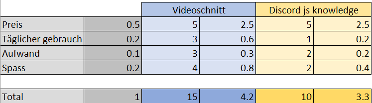

#Entscheiden

Warum haben wir uns für ein Videoschnittprojekt entschieden?
 

Bei diesem Bild sieht man deutlich, dass uns das Schneiden, nicht nur mehr Spass macht, sondern auch öfters verwendet werden kann. Beim Vergleichen haben wir absichtlich diese Punkte genommen, da wir dachten, dass diese Punkte am meisten Sinn machen. Uns war es wichtig, dass wir unsere Videos selber erarbeiten.

--------------------------------------------------------------------------
[Zurück](README.md)