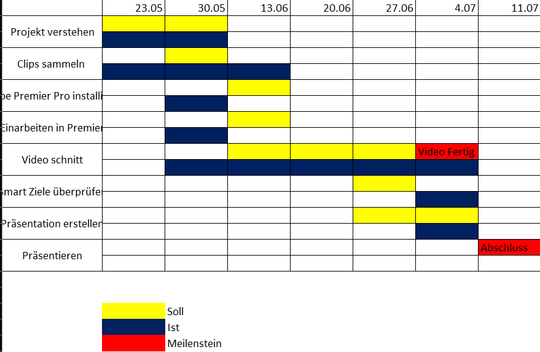

#Planen
Das Planen haben wir mit einem Zeitplan gemacht, denn in dem wir uns Meilensteine gesetzt haben. 
•    Clips zusammen sammeln                     30.05
•    Begin mit Schnitt                          13.06
•    Schnitt weiterführen                       20.06
•    Kontrolle/ Präsentation erstellen          27.06
•    Fertigstellung der Präsentation/ Video     04.07
•    Präsentation                               11.07

Das war der grobe Zeitplan. Der richtige Zeitplan, sieht so aus (Stand 04.07.22).

--------------------------------------------------------------------------
[Zurück](README.md)