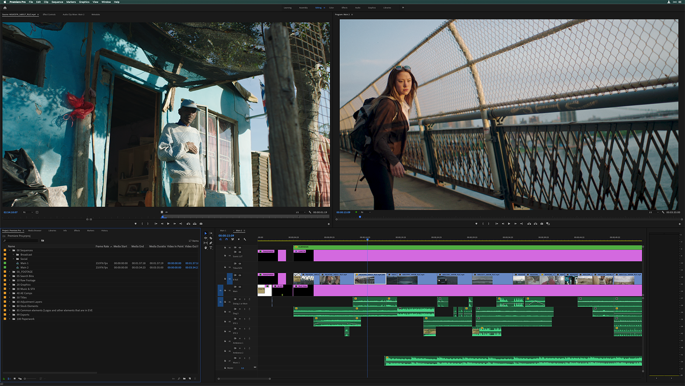

# Realisieren

Am Anfang des Realisierens haben wir zuerst alle unseren Gesammelten Clips zusammengelegt und per Discord an Gianluca gesendet, da er das Video schneiden wird. Gianluca hat diese Videos ins Premier Pro eingefügt, wo Gianluca dieses Video schneiden wird. Beginnen des Realisierens, haben wir am 13.06. 
Das Video beginnt, mit einem Intro, welches nur simpel gehalten wurde, weil wir uns auf das Video fokussieren wollten. Die Clips waren 30 s lang und mussten daher gekürzt werden, da niemand sich ein Video ansehen will, in welchem die Hälfte der Zeit nichts passiert. Wir haben zudem noch welche Memes eingebaut, um es stimmiger zu machen. Da die Clips nicht alle aus demselben Format waren, mussten wir zusammen die Videos vereinheitlichen. 

Quelle [Adobe](https://helpx.adobe.com/de/premiere-pro/using/bestpractices-editing.html)

--------------------------------------------------------------------------
[Zurück](README.md)